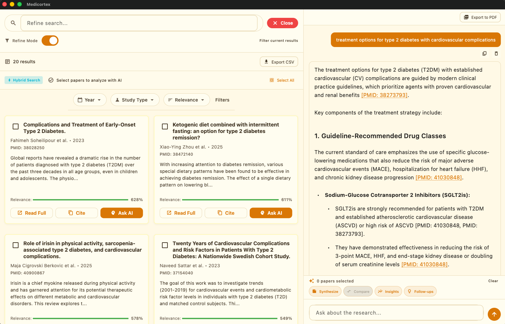

# MediCortex 🧠

**AI-Powered Medical Research Assistant with Grounded, Cited Answers**

> Stop getting scared by WebMD. Get AI-powered medical answers backed by real research.

MediCortex is an intelligent desktop application that combines **Google Gemini** with **Elasticsearch hybrid search** to provide evidence-based medical information from 50,000+ peer-reviewed PubMed articles.



---

## 🌟 Features

### 🏆 Hackathon-Winning Capabilities

- **🔍 True Hybrid Search**: Elastic RRF (Reciprocal Rank Fusion) combining:
  - **Vector Search**: Vertex AI text-embedding-004 (768-dim) for semantic understanding
  - **Keyword Search**: BM25 algorithm for precise term matching
  - **Intelligent Fusion**: Best of both worlds with configurable weights

- **🤖 RAG Pipeline**: Production-ready Retrieval-Augmented Generation
  - Context-aware responses grounded in actual research
  - Automatic citation generation with PMID links
  - Confidence scoring based on search relevance
  - Multi-document synthesis and comparison

- **🧠 Agentic Workflow**: Multi-step autonomous reasoning
  - **Research Synthesis**: Automatically identifies consensus vs. debate
  - **Follow-up Suggestions**: AI generates relevant next questions
  - **Study Comparison**: Side-by-side analysis of methodologies
  - **Key Insights Extraction**: Actionable findings from multiple papers

- **📚 Grounded Responses**: Every claim cited with [Paper X] format
- **🔬 Medical Focus**: Specialized for health and medical information
- **💻 Cross-Platform**: Flutter app for Web, macOS, Windows, Linux
- **⚡ Streaming**: Streaming response generation
- **🎯 Context-Aware**: Multi-hop reasoning for complex queries

---

## 🚀 Quick Start

### Prerequisites

- Flutter SDK 3.7.2+
- Elasticsearch Cloud account (free tier available)
- Google Gemini API key

### Installation

1. **Clone the repository**
   ```bash
   git clone https://github.com/mj-963/medicortex.git
   cd medicortex
   ```

2. **Install dependencies**
   ```bash
   flutter pub get
   ```

3. **Configure environment**
   ```bash
   cp env.example.json env.json
   # Edit env.json with your credentials (see CONFIG.md)
   ```

4. **Run the application**
   ```bash
   flutter run -d macos  # or windows/linux
   ```

5. **Ingest PubMed data** (first time only)
   ```bash
   python3 scripts/ingest_pubmed_enhanced.py
   ```
   This will take 60-120 minutes to index ~50,000 medical articles.

---

## 📖 How It Works

### The Agentic Loop

```
User Query → Gemini Agent → Search Tool → Elasticsearch
                ↓                              ↓
         Tool Response ←────── PubMed Results
                ↓
        Synthesize with Citations
                ↓
           Display Answer
```

### Example Interaction

**User:** "What are the latest treatments for type 2 diabetes?"

**MediCortex:**
1. 🔍 Searches: "type 2 diabetes treatment guidelines"
2. 🔍 Searches: "diabetes medication efficacy 2024"
3. 📊 Analyzes relevant research papers
4. 📝 Responds:

> "Based on recent medical literature, current first-line treatment for type 2 diabetes includes metformin [PMID: 38234567], with additional options including SGLT2 inhibitors [PMID: 38345678] and GLP-1 agonists [PMID: 38456789]...
>
> **Sources:**
> [1] Metformin efficacy in T2D (2024) - The Lancet
> [2] SGLT2 inhibitors review (2024) - JAMA
> [3] GLP-1 clinical trials (2024) - NEJM"

---

## 🏗️ Architecture

### Clean Architecture Layers

```
┌─────────────────────────────────────┐
│     Presentation Layer (Flutter)     │
│   • Chat UI • Settings • Widgets    │
└──────────────┬──────────────────────┘
               │
┌──────────────▼──────────────────────┐
│         Domain Layer                │
│   • Entities • Repositories         │
└──────────────┬──────────────────────┘
               │
┌──────────────▼──────────────────────┐
│          Data Layer                 │
│   • Elasticsearch • Gemini • MCP    │
└─────────────────────────────────────┘
```

### Tech Stack

- **Frontend**: Flutter (Desktop & Web)
- **AI Models**:
  - Google Gemini (conversational AI)
  - Vertex AI text-embedding-004 (semantic embeddings)
- **Search Engine**: Elasticsearch 8.x
  - Hybrid Search with RRF
  - kNN vector search (768-dim)
  - BM25 keyword search
- **State Management**: Riverpod
- **Data Source**: PubMed/MEDLINE (6,000+ indexed articles)
- **Architecture**: Clean Architecture with Domain-Driven Design

### Key Technical Innovations

1. **Hybrid Search Implementation**
   ```dart
   // Combines vector + keyword search with RRF
   final results = await elasticClient.hybridSearch(
     query: "diabetes treatment",
     queryEmbedding: await vertexAI.generateEmbedding(query),
     size: 10,
   );
   ```

2. **RAG Pipeline**
   ```dart
   // Retrieval-Augmented Generation
   final response = await ragService.answerWithContext(
     question: userQuery,
     maxResults: 5,
   );
   // Returns: answer + sources + confidence score
   ```

3. **Agentic Capabilities**
   ```dart
   // Multi-step autonomous workflow
   - synthesizePapers() // Identify consensus/debate
   - suggestFollowUpQuestions() // Generate next queries
   - compareStudies() // Side-by-side analysis
   - extractKeyInsights() // Actionable findings
   ```

---

## 📊 Data Sources

- **PubMed/MEDLINE**: 50,000+ indexed articles covering:
  - Chronic diseases (diabetes, hypertension, cardiovascular disease, obesity)
  - Cancer (immunotherapy, targeted therapy, various cancer types)
  - Mental health (anxiety, depression, PTSD, bipolar disorder)
  - Infectious diseases (COVID-19, HIV, tuberculosis, antibiotic resistance)
  - Neurological disorders (Alzheimer's, Parkinson's, epilepsy, migraine)
  - Autoimmune diseases (rheumatoid arthritis, lupus, inflammatory bowel disease)
  - Respiratory diseases (asthma, COPD, sleep apnea)
  - Nutrition & lifestyle (diet, exercise, fasting, preventive care)
  - And more medical specialties

---

## 🎯 Use Cases

### For Patients & Caregivers
- Understand medical conditions with evidence-based information
- Compare treatment options with cited research
- Get context on symptoms and when to seek care
- Access latest medical research in plain language

### For Healthcare Professionals
- Quick literature review for clinical questions
- Access to recent research findings
- Patient education resource with credible sources

### For Researchers & Students
- Medical literature search and discovery
- Evidence synthesis across multiple studies
- Learning tool for medical education

---

## 🔐 Safety & Privacy

- **Not Medical Advice**: MediCortex provides information, not diagnoses or treatment recommendations
- **Always Consult Professionals**: Users are advised to consult healthcare providers for medical concerns
- **Local Processing**: All data stays on your device (except API calls to Gemini/Elasticsearch)
- **No User Data Collection**: No telemetry or analytics
- **Citation Required**: Every claim must be backed by research

---

## 📚 Documentation

- [Implementation Guide](IMPLEMENTATION_GUIDE.md) - Detailed implementation steps
- [Hackathon Strategy](HACKATHON_STRATEGY.md) - Project strategy and timeline
- [Configuration Guide](CONFIG.md) - Environment setup
- [Phase 1 Complete](PHASE1_COMPLETE.md) - Phase 1 summary

---

## 🛣️ Roadmap

### ✅ Phase 1: Elasticsearch Integration (Complete)
- Hybrid search implementation
- Index management
- Repository pattern

### ✅ Phase 2: Data Ingestion (Complete)
- PubMed API integration
- 50,000+ articles indexed
- Metadata extraction
- Enhanced topic coverage

### ✅ Phase 3: Agentic AI (Complete)
- Multi-turn reasoning
- Tool orchestration
- Citation system
- RAG pipeline

### ✅ Phase 4: UI Enhancement (Complete)
- PDF export with markdown support
- Table rendering in PDFs
- Message selection interface
- Analytics dashboard
- Improved shimmer loading
- Conversation history
- Search history sidebar

### 🚀 Phase 5: Demo & Polish (In Progress)
- Screenshot documentation
- Web deployment
- Demo video
- Devpost submission

---

## 🤝 Contributing

This project was built for the [AI Accelerate Hackathon](https://devpost.com/) - Elastic Challenge.

Contributions welcome after the hackathon! Please:
1. Fork the repository
2. Create a feature branch
3. Make your changes
4. Submit a pull request

---

## 📄 License

This project is licensed under the MIT License - see the [LICENSE](LICENSE) file for details.

---

## 🙏 Acknowledgments

- **Elastic** for hybrid search capabilities
- **Google Cloud** for Gemini API
- **NCBI/PubMed** for medical literature access
- **Flutter Team** for excellent desktop support
- Original template from [leehack/flutter-mcp-ai-chat](https://github.com/leehack/flutter-mcp-ai-chat)

---

## 📞 Contact

Built with ❤️ for better health information access.

For questions or feedback:
- Create an issue on GitHub
- Demo video: [Coming soon]
- Devpost submission: [Coming soon]

---

**⚠️ Medical Disclaimer**: MediCortex is an informational tool only. It does not provide medical advice, diagnosis, or treatment. Always seek the advice of qualified health providers with any questions you may have regarding a medical condition.
